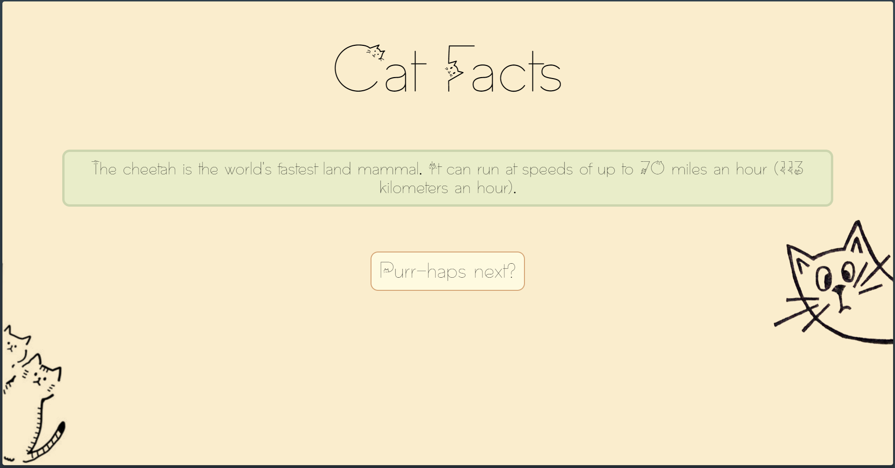

# Cozy Cat Facts

Welcome to the Cozy Cat Facts website, a purr-fect place for cat enthusiasts to learn fun and interesting facts about their feline friends. Built with Astro, this project showcases a simple yet engaging user interface that cat lovers of all ages will enjoy.

## Features

- **Dynamic Cat Facts**: Click the "Purr-haps next?" button to fetch a new cat fact every time. Our facts are short, sweet, and guaranteed to make you smile.
- **Responsive Design**: Enjoy cat facts on any device, thanks to our mobile-friendly design.
- **Custom Fonts and Styling**: Experience our cozy theme with custom fonts and styles designed to create a warm and welcoming atmosphere.

## Project Structure

- `index.astro`: The main page that users interact with. It includes a button to fetch new cat facts and displays them in a styled info box.
- `Layout.astro`: A reusable layout component that defines the structure and style of the website, including the global font and background color.
- `Images/`: Holds the cat images used in the project.

## Getting Started

To run this project locally, follow these steps:

1. Clone the repository to your local machine.
2. Navigate to the project directory.
3. Install dependencies with `npm install`.
4. Start the development server with `npm run dev`.
5. Open your browser and go to `http://localhost:3000` to view the project.

## Dependencies

- Astro: For building the website.
- Fetch API: For fetching cat facts from the `catfact.ninja` API.

## Contributing

Contributions are welcome! If you have ideas for new features or improvements, feel free to fork the repository and submit a pull request.

## License

This project is open source and available under the [MIT License](LICENSE).

Enjoy exploring and learning with Cozy Cat Facts!